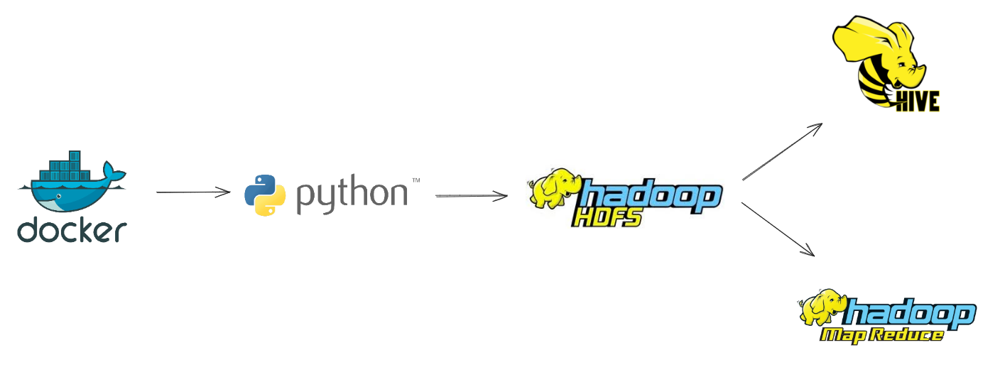

#  Healthcare Big Data Analytics Pipeline

##  Pipeline Architecture


##  Project Overview  
This project implements a **batch analytics pipeline** on the **MIMIC-III** clinical dataset using Big Data tools. The goal is to extract meaningful healthcare insights through distributed processing, focusing on batch computations such as **average patient age**, **length of stay**, and **readmission statistics**.

---

##  Tools & Technologies  

| Tool           | Purpose                                                        |
|----------------|----------------------------------------------------------------|
| **Hadoop HDFS** | Distributed storage for large-scale healthcare data            |
| **MapReduce**   | Batch processing for calculating metrics like average age      |
| **Hive**        | SQL-like querying interface for structured healthcare records  |
| **Docker**      | Containerized environment for running Hadoop and Hive services |
| **Python**      | Pandas for cleaning data and Pyarrow for converting files to Parquet |

---

##  Data Sources  

- **Dataset:** [MIMIC-III Clinical Database Demo v1.4](https://physionet.org/content/mimiciii-demo/1.4/)
- **Tables used:**
  - `PATIENTS.csv`
  - `ADMISSIONS.csv`
  - `ICUSTAYS.csv`
  - `LABEVENTS.csv`
  - `DIAGNOSES_ICD.csv`

---

##  Pipeline Components  

### 🔹 Data Preparation  
- Cleaned the original CSV files.
- Converted them into Big Data-compatible formats.
- Uploaded into **HDFS**.

### 🔹 Batch Processing  
- A custom **MapReduce** job was created to calculate the average age of patients.
- **Hive** was used to run SQL-based queries for batch analytics:
  - Average length of stay per diagnosis.
  - ICU readmission distribution.
  - Mortality rates segmented by demographic group.

---

##  Output & Results  

-  **Average Patient Age** computed via MapReduce
-  **Hive Queries** generated meaningful healthcare statistics

---

##  Learning Outcomes  

- Built a batch analytics pipeline using industry-standard tools.
- Gained hands-on experience with **Hadoop**, **HDFS**, **MapReduce**, and **Hive**.
- Understood the process of transforming raw healthcare data into useful insights.
- Practiced running data engineering workflows in a **Dockerized environment**.

---

##  Project Structure  

```
Healthcare-Data-Analytics-Pipeline/
├── Cleaning scripts/                # Scripts used for data cleaning
├── Converting to parquet scripts/  # Scripts to convert CSV files to Parquet format
├── Dataset/                        # Raw and cleaned datasets
├── MapReduce/                      # Java code for processing data using MapReduce
│   └── AverageAge.java
├── Hive Queries/                   # HiveQL scripts for querying the data
├── UserManual.pdf                  # Guide for how to run and understand the project
├── README.md                       # Project documentation

```

---

##  Author  

- **Youssef Mohamed Abdo Mansour**  
- Data Engineering Trainee – ITI Intensive Code Camp
- youssef.abdo2910@gmail.com
